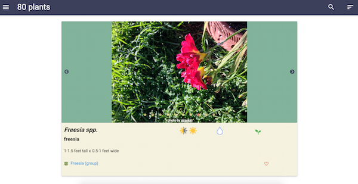
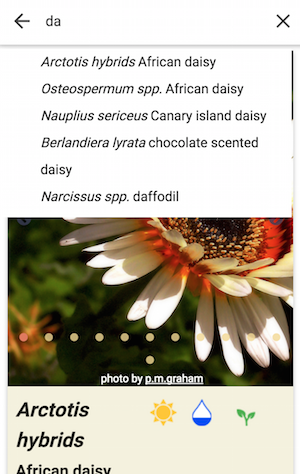

# Toyon: California garden plant screener

This project combines water requirements from the [Water Use Classification of Landscape Species](http://ucanr.edu/sites/WUCOLS/) database, plant characteristics from [Missouri Botanical Garden](http://www.missouribotanicalgarden.org/) and [San Marcos Growers)[http://www.smgrowers.com/], and plant photos from [Flickr](http://www.flickr.com) on a modern, responsive website I can use anywhere: **[toyon.serris.net](http://toyon.serris.net)**.

In my garden, cold hardiness is almost irrelevant.  With no rain from May to September, water requirements
are key, yet garden books intended for the entire US often pay little attention to water.  [Plants and Landscapes for Summer-Dry Climates](http://www.amazon.com/Plants-Landscapes-Summer-Dry-Climates-Francisco/dp/0975323113) is big, beautiful, and is great for browsing, but not necessarily for finding plants to buy.  Garden books have several limitations:

- not great for filtering (for example, find low water use, partial shade, 2-4 foot tall plants)
- never enough pictures; sometimes there's a closeup, sometimes a landscape
- too big and bulky to carry around when shopping for plants at the nursery
- local nurseries have constantly changing inventory, so what seems like the perfect plant may or may not be readily available

At the nursery, plant labels are often vague ("regular water") or missing important information (how big does it get?).  Nurseries, especially big-box retailers, carry lots of plants that aren't adapted to my dry summer Mediterranean climate.

Crowd-sourced garden sites such as <a href="http://davesgarden.com/">Dave's Garden</a> have lots of information, but of suspect quality and/or relevance (are the reviewers who said "low water" from Oregon or Arizona?)  They also serve a national or international audience, so most contributors live in very different climates than mine.

Toyon is for California gardeners who want to browse, filter, and search Mediterranean-adapted garden plants. 

## details

### data

[Water Use Classfication of Landscape Species](http://ucanr.edu/sites/WUCOLS/) (WUCOLS) is an amazing resource.  It

> provides evaluations of the irrigation water needs for over 3,500 taxa ... used in California landscapes. It is based on the observations and extensive field experience of thirty-six landscape horticulturists

Clearly a lot of work went into collecting this data, the csv and pdf 
versions are really hard to use. I reformatted and reorganized the 
data to make it easy to use, especially on a small screen.

#### sparse matrix

one column for each plant type, with the column header value in a 
cell to indicate presence

lots of wasted space; _combined into one column_

#### plant types

3 different types of info mixed together:

- category (bulb, grass, groundcover, perennial, shrub, tree, vine)
- group (bamboo, palm and cycad, succulent); these are never used alone
- California native

_separated into three columns_

#### abbreviations

some abbreviations are substrings of others:

- VL (very low) and L (low) water requirements
- G (gross) and Gc (groundcover)
- P (perennial) and Pm (palm and cycad)
- S (shrub) and Su (succulent)

_changed to be non-overlapping_

water

- VL -> N none
- L -> L low
- M -> M moderate
- H -> H high

#### 6 regions

new set of codes (1-6)

_put Sunset zones in header; added range of water needs_

#### plants with no data

_removed plants that don't have data_

#### see also

some entries reference a different name; requires another lookup

_moved to same row as preferred name so you're in the right spot after searching_

#### misc cleanup

_removed a few with no categories_

sometimes botantical name field contained extra notes not part of name (eg. 
partial shade in South Inland); _moved to extra info column_

#### just water info

The WUCOLS data includes names and water requirements for several thousand
plants, but no other plant requirements (sun or shade? 1 or 20 feet tall)?
[scripts](scripts/README.md) scrape data on plants and write it to one 
database.

### output

More details on the [scripts](scripts/README.md)

The output of these transforms is a spreadsheet: 
[WUCOLS plant database reformatted for ease of use](https://docs.google.com/spreadsheets/d/1AYyaBizzfew_oH6Ky1dGkvvfOpmgcb2jLkotVvGOTLI/edit?usp=sharing)

A JSON version of this data powers the UI at [toyon.serris.net](http://toyon.serris.net).

### UI

The UI presents the plant data described above as Material cards.  Each card includes plant photos in a carousel, sun and water requirements, common and botanical names, and links to external pages about specific varieties.

The left menu allows filtering plants by sun requirements, water requirements, size, or favorite status.

The search icon allows seaching for a specific plant within the filtered set.  Plants can be sorted by botanical name, common name, water, sun, height, or spread.

The UI is written in React, with the help of several open-source projects, including

- [Materialize, a CSS Framework based on Material Design](http://materializecss.com/)
- [React Starterify](https://github.com/Granze/react-starterify)
- [Slick carousel](http://kenwheeler.github.io/slick/)

More details on the [UI](web/README.md)

